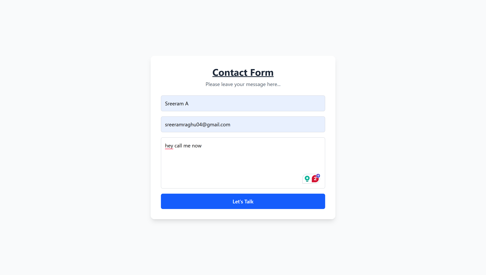
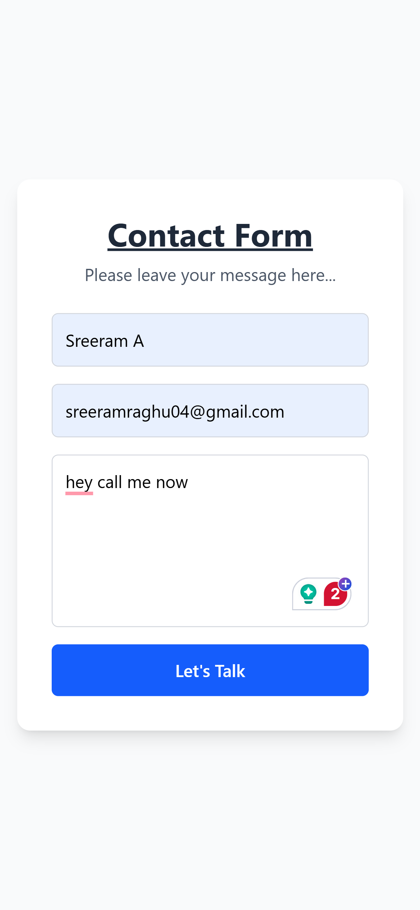

# 📬 Contact Form

This is a simple and clean contact form built with **React** and **TailwindCSS**, integrated with **EmailJS** to send form submissions directly to your email inbox without needing a backend server.

---

## ✨ Features

- 🧾 Clean and minimal contact form UI
- 📧 Email delivery using [EmailJS](https://www.emailjs.com/)
- 🎨 Styled with TailwindCSS for responsive and modern design
- 🚫 No backend needed

---

## 🔧 Technologies Used

- React
- TailwindCSS
- EmailJS

---

## Screenshots

- Large Screen
  

- Small Screen
  

## Demo Link

[Live Demo](https://react-contactform-p12.netlify.app/)
